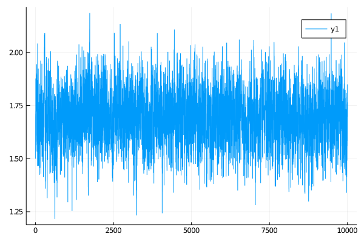

# BiBlock
****
A composite unit that represents a block. It can be used for sampling on a block in a setting of smoothing or inference.
```@docs
DiffusionMCMCTools.BiBlock
```

There are many functions implemented for it.

#### Imputation of paths
----
```@docs
DiffusionMCMCTools.draw_proposal_path!(bb::DiffusionMCMCTools.BiBlock)
```

#### Accept/reject decision in an MCMC setting
-----
```@docs
DiffusionMCMCTools.accept_reject_proposal_path!(bb::DiffusionMCMCTools.BiBlock, mcmciter)
```

#### Adjustments made after the accept-reject decision (regardless of what it was)
----
```@docs
DiffusionMCMCTools.set_accepted!(bb::DiffusionMCMCTools.BiBlock, i::Int, v)
```

#### Adjustments to the containers in case of **acceptance** of proposals:
----
```@docs
DiffusionMCMCTools.swap_paths!(bb::DiffusionMCMCTools.BiBlock)
DiffusionMCMCTools.swap_XX!(bb::DiffusionMCMCTools.BiBlock)
DiffusionMCMCTools.swap_WW!(bb::DiffusionMCMCTools.BiBlock)
DiffusionMCMCTools.swap_PP!(bb::DiffusionMCMCTools.BiBlock)
DiffusionMCMCTools.swap_ll!(bb::DiffusionMCMCTools.BiBlock)
```

#### Setting up a block
----
```@docs
DiffusionMCMCTools.set_obs!(bb::DiffusionMCMCTools.BiBlock)
DiffusionMCMCTools.recompute_guiding_term!(bb::DiffusionMCMCTools.BiBlock)
DiffusionMCMCTools.find_W_for_X!(bb::DiffusionMCMCTools.BiBlock)
```

#### Setting parameters
----
```@docs
DiffusionMCMCTools.set_proposal_law!(
    bb::DiffusionMCMCTools.BiBlock,
    θ°,
    pnames,
    critical_change=DiffusionMCMCTools.is_critical_update(bb, pnames),
    skip=0
)

```

#### Utility
----
```@docs
DiffusionMCMCTools.ll_of_accepted(bb::DiffusionMCMCTools.BiBlock, i)
DiffusionMCMCTools.accpt_rate(bb::DiffusionMCMCTools.BiBlock, range)
DiffusionMCMCTools.loglikhd!(bb::DiffusionMCMCTools.BiBlock)
DiffusionMCMCTools.loglikhd°!(bb::DiffusionMCMCTools.BiBlock)
DiffusionMCMCTools.save_ll!(bb::DiffusionMCMCTools.BiBlock, i::Int)
```

# Example: smoothing with no blocking
----------
## Set-up
```julia
using GuidedProposals, DiffusionDefinition, ObservationSchemes, DiffusionMCMCTools
const GP = GuidedProposals
const DD = DiffusionDefinition
const OBS = ObservationSchemes
const dMCMCt = DiffusionMCMCTools

using StaticArrays, Random, Plots

# seed used for this tutorial
Random.seed!(100)

@load_diffusion FitzHughNagumo
θ = [0.1, -0.8, 1.5, 0.0, 0.3]
P = FitzHughNagumo(θ...)
tt, y1 = 0.0:0.0001:10.0, @SVector [-0.9, -1.0]
X = rand(P, tt, y1)
obs_scheme = ObsScheme(
    LinearGsnObs(
        0.0, (@SVector [0.0]);
        L=(@SMatrix [1.0 0.0]),
        Σ=(@SMatrix [0.01])
    )
)
data = collect(obs_scheme, X, 1000)
recording = build_recording(P, data, 0.0, KnownStartingPt(y1))

plot(X, Val(:vs_time), size=(800, 300))
scatter!(map(x->x.t, data), map(x->x.obs[1], data), label="data")
```


## The algorithm
```julia
function simple_smoothing(AuxLaw, recording, dt; ρ=0.5, num_steps=10^4)
    tts = OBS.setup_time_grids(recording, dt, standard_guid_prop_time_transf)
    # this object contains containers
    sp = SamplingPair(AuxLaw, recording, tts)
    # and this has pointers to containers and facilitates actual sampling
    bb = BiBlock(sp, 1:length(recording.obs), ρ, true, num_steps)
    loglikhd!(bb)
    paths = []

    # MCMC
    for i in 1:num_steps
        # impute a path
        draw_proposal_path!(bb)
        # Metropolis–Hastings accept/reject step
        accept_reject_proposal_path!(bb, i)

        # progress message
        if i % 100 == 0
            println(
                "$i. ll=$(ll_of_accepted(bb, i)), acceptance rate: ",
                "$(sum(bb.accpt_history[(i-99):i])/100)"
            )
        end

        # save intermediate path for plotting
        i % 400 == 0 && append!(paths, [deepcopy(bb.b.XX)])
    end
    paths
end

@load_diffusion FitzHughNagumoAux
paths = simple_smoothing(
    FitzHughNagumoAux, recording, 0.001; ρ=0.96, num_steps=10^4
)
```

## Results
```julia
function glue_paths(XX)
    XX_glued = trajectory(
        glue_containers( map(x->x.t, XX) ),
        glue_containers( map(x->x.x, XX) ),
    )
end

function glue_containers(xs)
    glued_xs = collect(Iterators.flatten(map(x->x[1:end-1], xs)))
    append!(glued_xs, [xs[end][end]])
    glued_xs
end

convenient_paths = glue_paths.(paths)

col = ["#581845", "#900C3F", "#C70039", "#FF5733", "#FFC300"]

p = plot(size=(1000, 500))
for path in convenient_paths
	plot!(p, path, Val(:vs_time), alpha=0.4, label="", color=[col[3] col[1]])
end
plot!(X, Val(:vs_time), color=[col[5] col[4]], linewidth=[3 0.5], label=["underlying X₁" "underlying X₂"])
scatter!(p, map(x->x.t, data), map(x->x.obs[1], data), label="data", markercolor=col[5])
display(p)
```


# Example: smoothing with blocking
----
## Set-up
Same as above

## The algorithm
```julia
function simple_smoothing_with_blocking(
        AuxLaw, recording, dt, AuxLawBlocking, block_layout;
        ρ=0.5, num_steps=10^4
    )
    tts = OBS.setup_time_grids(recording, dt, standard_guid_prop_time_transf)
    # this object contains containers
    sp = SamplingPair(AuxLaw, recording, tts)
    # and this has pointers to containers and facilitates actual sampling
    blocks = [
        [
            BiBlock(sp, br, ρ, i==length(block_ranges), num_steps)
            for (i,br) in enumerate(block_ranges)
        ] for block_ranges in block_layout
    ]

    paths = []

    N = length(blocks)
    # MCMC
    for i in 1:num_steps
        for B in blocks
            # freeze terminal points of blocks to be artificial observations
            GP.set_obs!.(B)
            # recompute the guiding term only on the "accepted" laws `bb.b.PP`
            (bb->recompute_guiding_term!(bb.b)).(B)
            # recompute the Wiener path
            find_W_for_X!.(B)
            # re-evaluate the log-likelihood
            loglikhd!.(B)
            # impute a path
            draw_proposal_path!.(B)
            # Metropolis–Hastings accept/reject step
            accept_reject_proposal_path!.(B, i)

            # progress message
            if i % 100 == 0
                println(
                    "$i. ll=$(ll_of_accepted.(B, i)), acceptance rate: ",
                    "$( map(bb->accpt_rate(bb, (i-99):i), B) )"
                )
            end
        end

        # save intermediate path for plotting
        i % 400 == 0 && append!(paths, [deepcopy(sp.u.XX)])
    end
    paths
end
```

## Results
```julia
@inline DD.nonhypo(x, P::FitzHughNagumo) = x[SVector{1,Int64}(2)]
@inline DD.nonhypo_σ(t::Float64, x, P::FitzHughNagumo) = SMatrix{1,1,Float64}(P.σ)
paths = simple_smoothing_with_blocking(
    FitzHughNagumoAux, recording, 0.001, FitzHughNagumoAux,
    [[1:25,26:75,76:100],[1:50, 51:100]];
    ρ=0.96, num_steps=10^4
)
```
Same plotting routines as above yield:


# Example: inference with no blocking
----

## Set up
Same as before

## The algorithm

```julia
customkernel(θ, scale=0.1) = θ .+ 2.0*scale*(rand()-0.5)

#=
    NOTE: this will appear to be completely unnecessary and coming out of the
    blue if you are not considering more complicated settings of mixed effect
    models. Looking up ahead into the definition of ... should be helpful if
    you want to understand what the function below is aiming to do.

    In here, we are just creating the most basic struture that is needed for
    setting parameters. It can be much more complex if blocking, multiple
    updates and/or mixed effect models were used.
=#
#↓ ↓ ↓ ↓ ↓ ↓ ↓ ↓ ↓ ↓ ↓ ↓ ↓ ↓ ↓ ↓ ↓ ↓ ↓ ↓ ↓ ↓ ↓ ↓ ↓ ↓ ↓ ↓ ↓ ↓ ↓ ↓ ↓ ↓ ↓ ↓ ↓ ↓ ↓ ↓
_build_struct(N, args...) = (
    var = tuple(),
    var_aux = fill(tuple(), N),
    updt = tuple(args...),
    updt_aux = fill(tuple(args...), N),
    updt_obs = fill(tuple(), N),
)

function simple_name_structure(pname::Symbol, num_obs)
    pnames = (
        PP = _build_struct(num_obs, (1=>pname)),
        P_last = _build_struct(0), # was num_obs
        P_excl = _build_struct(0),
        Pb_excl = _build_struct(num_obs, (1=>pname)),
    )
end
#↑ ↑ ↑ ↑ ↑ ↑ ↑ ↑ ↑ ↑ ↑ ↑ ↑ ↑ ↑ ↑ ↑ ↑ ↑ ↑ ↑ ↑ ↑ ↑ ↑ ↑ ↑ ↑ ↑ ↑ ↑ ↑ ↑ ↑ ↑ ↑ ↑ ↑ ↑ ↑

function accept_reject_proposal_param!(bb, mcmciter, θ, θ°)
    accepted = rand(Exponential(1.0)) > -(bb.b°.ll - bb.b.ll)
    accepted && swap_XX!(bb)
    accepted && swap_PP!(bb)
    save_ll!(bb, mcmciter)
    accepted && swap_ll!(bb)
    accepted, copy(accepted ? θ° : θ)
end

function simple_inference(AuxLaw, recording, dt, _θ; ϵ=0.3, ρ=0.5, num_steps=10^4)
    # making sure that things are in order...
    _pname = collect(keys(_θ))
    # for simplicity restrict to inference for a single param
    @assert length(_pname) == 1
    pname = first(_pname)
    θ = collect(values(_θ))

    # setting the initial guess θ inside the recording
    OBS.set_parameters!(recording, _θ)

    # setting up containers
    num_obs = length(recording.obs)
    tts = OBS.setup_time_grids(recording, dt, standard_guid_prop_time_transf)
    sp = SamplingPair(AuxLaw, recording, tts)
    bb = BiBlock(sp, 1:num_obs, ρ, true, num_steps)
    name_struct = simple_name_structure(pname, num_obs)

    loglikhd!(bb)
    paths = []

    θθ = [θ]
    a_h = Bool[]

    for i in 1:num_steps
        draw_proposal_path!(bb)
        accept_reject_proposal_path!(bb, i)

        θ° = customkernel(θ, ϵ)
        set_proposal_law!(bb, θ°, name_struct, true)

        accpt, θ = accept_reject_proposal_param!(bb, i, θ, θ°)
        push!(θθ, θ)
        push!(a_h, accpt)

        # progress message
        if i % 100 == 0
            println(
                "$i. ll=$(ll_of_accepted(bb, i)), ",
                "imp a-r: ",
                " $(accpt_rate(bb, (i-99):i)), ",
                "updt a-r: ",
                "$(sum(a_h[(i-99):i])/100)."
            )
        end

        # save intermediate path for plotting
        i % 400 == 0 && append!(paths, [deepcopy(sp.u.XX)])
    end
    paths, θθ
end
```

## Results
```julia
plot(getindex.(θθ, 1))
```


# Example: inference with blocking
----

## Set up

Same as before

## The algorithm

```julia
#↓ ↓ ↓ ↓ ↓ ↓ ↓ ↓ ↓ ↓ ↓ ↓ ↓ ↓ ↓ ↓ ↓ ↓ ↓ ↓ ↓ ↓ ↓ ↓ ↓ ↓ ↓ ↓ ↓ ↓ ↓ ↓ ↓ ↓ ↓ ↓ ↓ ↓ ↓ ↓
function simple_name_structure_not_last(pname::Symbol, num_obs)
    pnames = (
        PP = _build_struct(num_obs-1, (1=>pname)),
        P_last = _build_struct(1, (1=>pname)),
        P_excl = _build_struct(1, (1=>pname)),
        Pb_excl = _build_struct(num_obs-1, (1=>pname)),
    )
end

function simple_name_structure_blocking(pname::Symbol, block_layout)
    map(block_layout) do block_set
        map(enumerate(block_set)) do (i, block)
            (
                i == length(block_set) ?
                simple_name_structure(pname, length(block)) :
                simple_name_structure_not_last(pname, length(block))
            )
        end
    end
end
#↑ ↑ ↑ ↑ ↑ ↑ ↑ ↑ ↑ ↑ ↑ ↑ ↑ ↑ ↑ ↑ ↑ ↑ ↑ ↑ ↑ ↑ ↑ ↑ ↑ ↑ ↑ ↑ ↑ ↑ ↑ ↑ ↑ ↑ ↑ ↑ ↑ ↑ ↑ ↑

function accept_reject_proposal_param!(B::AbstractArray{<:BiBlock}, mcmciter, θ, θ°)
    accepted = rand(Exponential(1.0)) > mapreduce(bb->-(bb.b°.ll - bb.b.ll),+,B)
    accepted && swap_XX!.(B)
    accepted && swap_PP!.(B)
    (bb->save_ll!(bb.b, mcmciter)).(B)
    (bb->save_ll!(bb.b°, mcmciter)).(B)
    accepted && swap_ll!.(B)
    accepted, copy(accepted ? θ° : θ)
end


function simple_inference_with_blocking(
        AuxLaw, recording, dt, AuxLawBlocking, block_layout, _θ;
        ϵ=0.3, ρ=0.5, num_steps=10^4
    )
    # making sure that things are in order...
    _pname = collect(keys(_θ))
    # for simplicity restrict to inference for a single param
    @assert length(_pname) == 1
    pname = first(_pname)
    θ = collect(values(_θ))

    # setting the initial guess θ inside the recording
    OBS.set_parameters!(recording, _θ)

    # setting up containers
    tts = OBS.setup_time_grids(recording, dt, standard_guid_prop_time_transf)
    sp = SamplingPair(AuxLaw, recording, tts)
    blocks = [
        [
            BiBlock(sp, br, ρ, i==length(block_ranges), num_steps)
            for (i,br) in enumerate(block_ranges)
        ] for block_ranges in block_layout
    ]
    name_struct = simple_name_structure_blocking(pname, block_layout)

    paths = []

    θθ = [θ]
    a_h = Bool[]

    # MCMC
    for i in 1:num_steps
        for B in blocks
            GP.set_obs!.(B)
            (bb->recompute_guiding_term!(bb.b)).(B)
            find_W_for_X!.(B)
            loglikhd!.(B)
            draw_proposal_path!.(B)
            accept_reject_proposal_path!.(B, i)

            # progress message
            if i % 100 == 0
                println(
                    "$i. ll=$(ll_of_accepted.(B, i)), acceptance rate: ",
                    "$( map(bb->accpt_rate(bb, (i-99):i), B) )"
                )
            end
        end

        θ° = customkernel(θ, ϵ)

        B = blocks[end]
        for (idx, bb) in enumerate(B)
            set_proposal_law!(bb, θ°, name_struct[end][idx], true)
        end
        (bb->recompute_guiding_term!(bb.b°)).(B)

        accpt, θ = accept_reject_proposal_param!(B, i, θ, θ°)
        push!(θθ, θ)
        push!(a_h, accpt)

        if i % 100 == 0
            println(
                "$i. updt a-r: ",
                "$(sum(a_h[(i-99):i])/100)."
            )
        end

        # save intermediate path for plotting
        i % 400 == 0 && append!(paths, [deepcopy(sp.u.XX)])
    end
    paths, θθ
end
```

## The results

```julia
using OrderedCollections

θ = OrderedDict(:γ=>1.5)

DD.var_parameter_names(::FitzHughNagumo) = (:γ,)
DD.var_parameter_names(::FitzHughNagumoAux) = (:γ,)

@load_diffusion FitzHughNagumoAux
paths, θθ = simple_inference_with_blocking(
    FitzHughNagumoAux, recording, 0.001, FitzHughNagumoAux,
    [[1:25,26:75,76:100],[1:50, 51:100]], θ; ϵ=0.3, ρ=0.96, num_steps=10^4
)

plot(getindex.(θθ, 1))
```



!!! note
    As you can see above, `BiBlock` is the fundamental building block that is used for creating inference and smoothing algorithms. However, as the complexity of these algorithms grow it is useful to use some `macro structures` that operate on or are defined for multiple `BiBlock`s. This is precisely what the remaining tools defined in this package are for. Otherwise put, they aim to facilitate writing snippets of code as above in a much more compact and convenient way.
