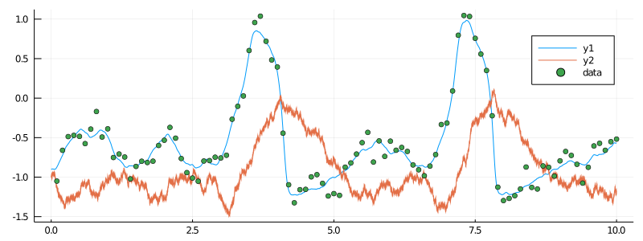
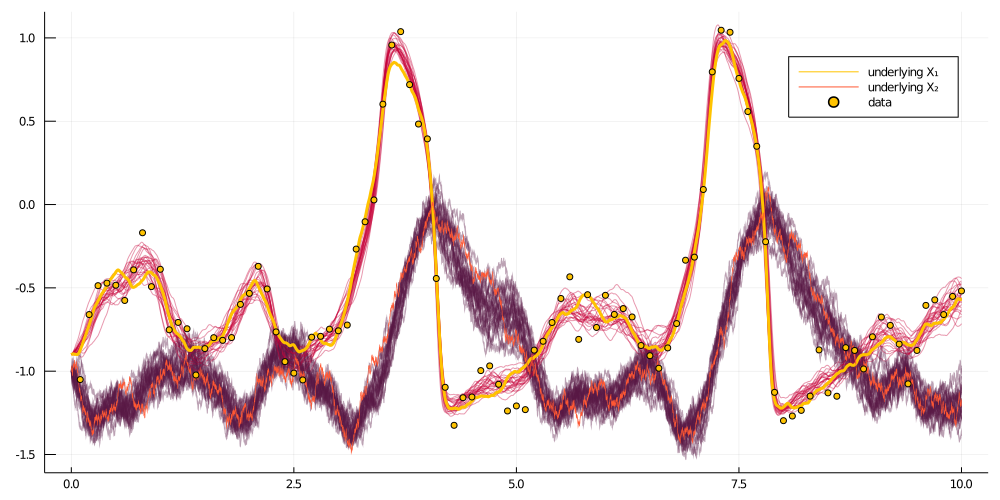

# BiBlock
****
A composite unit that represents a block. It can be used for sampling on a block in a setting of smoothing or inference.
```@docs
DiffusionMCMCTools.BiBlock
```

There are many functions implemented for it.

#### Imputation of paths
----
```@docs
DiffusionMCMCTools.draw_proposal_path!(bb::DiffusionMCMCTools.BiBlock)
```

#### Accept/reject decision in an MCMC setting
-----
```@docs
DiffusionMCMCTools.accept_reject_proposal_path!(bb::DiffusionMCMCTools.BiBlock, mcmciter)
```

#### Adjustments made after the accept-reject decision (regardless of what it was)
----
```@docs
DiffusionMCMCTools.set_accepted!(bb::DiffusionMCMCTools.BiBlock, i::Int, v)
```

#### Adjustments to the containers in case of **acceptance** of proposals:
----
```@docs
DiffusionMCMCTools.swap_paths!(bb::DiffusionMCMCTools.BiBlock)
DiffusionMCMCTools.swap_XX!(bb::DiffusionMCMCTools.BiBlock)
DiffusionMCMCTools.swap_WW!(bb::DiffusionMCMCTools.BiBlock)
DiffusionMCMCTools.swap_PP!(bb::DiffusionMCMCTools.BiBlock)
DiffusionMCMCTools.swap_ll!(bb::DiffusionMCMCTools.BiBlock)
```

#### Setting up a block
----
```@docs
DiffusionMCMCTools.set_obs!(bb::DiffusionMCMCTools.BiBlock)
DiffusionMCMCTools.recompute_guiding_term!(bb::DiffusionMCMCTools.BiBlock)
DiffusionMCMCTools.find_W_for_X!(bb::DiffusionMCMCTools.BiBlock)
```

#### Utility
----
```@docs
DiffusionMCMCTools.ll_of_accepted(bb::DiffusionMCMCTools.BiBlock, i)
DiffusionMCMCTools.accpt_rate(bb::DiffusionMCMCTools.BiBlock, range)
```

#### Setting parameters
----
```@docs
DiffusionMCMCTools.set_proposal_law!(
      bb::DiffusionMCMCTools.BiBlock,
      θ°,
      pnames,
      critical_change=DiffusionMCMCTools.is_critical_update(bb, pnames),
      skip=0
  )
```

# Example: smoothing with no blocking
----------
## Set-up
```julia
using GuidedProposals, DiffusionDefinition, ObservationSchemes, DiffusionMCMCTools
const GP = GuidedProposals
const DD = DiffusionDefinition
const OBS = ObservationSchemes
const dMCMCt = DiffusionMCMCTools

using StaticArrays, Random, Plots

# seed used for this tutorial
Random.seed!(100)

@load_diffusion FitzHughNagumo
θ = [0.1, -0.8, 1.5, 0.0, 0.3]
P = FitzHughNagumo(θ...)
tt, y1 = 0.0:0.0001:10.0, @SVector [-0.9, -1.0]
X = rand(P, tt, y1)
obs_scheme = ObsScheme(
    LinearGsnObs(
        0.0, (@SVector [0.0]);
        L=(@SMatrix [1.0 0.0]),
        Σ=(@SMatrix [0.01])
    )
)
data = collect(obs_scheme, X, 1000)
recording = build_recording(P, data, 0.0, KnownStartingPt(y1))

plot(X, Val(:vs_time), size=(800, 300))
scatter!(map(x->x.t, data), map(x->x.obs[1], data), label="data")
```


## The algorithm
```julia
function simple_smoothing(AuxLaw, recording, dt; ρ=0.5, num_steps=10^4)
    tts = OBS.setup_time_grids(recording, dt, standard_guid_prop_time_transf)
    # this object contains containers
    sp = SamplingPair(AuxLaw, recording, tts)
    # and this has pointers to containers and facilitates actual sampling
    bb = BiBlock(sp, 1:length(recording.obs), ρ, true, num_steps)
    bb.b.ll = loglikhd(bb.b)
    paths = []

    # MCMC
    for i in 1:num_steps
        # impute a path
        draw_proposal_path!(bb)
        # Metropolis–Hastings accept/reject step
        accept_reject_proposal_path!(bb, i)

        # progress message
        if i % 100 == 0
            println(
                "$i. ll=$(ll_of_accepted(bb, i)), acceptance rate: ",
                "$(sum(bb.accpt_history[(i-99):i])/100)"
            )
        end

        # save intermediate path for plotting
        i % 400 == 0 && append!(paths, [deepcopy(bb.b.XX)])
    end
    paths
end

@load_diffusion FitzHughNagumoAux
paths = simple_smoothing(
    FitzHughNagumoAux, recording, 0.001; ρ=0.96, num_steps=10^4
)
```

## Results
```julia
function glue_paths(XX)
    XX_glued = trajectory(
        glue_containers( map(x->x.t, XX) ),
        glue_containers( map(x->x.x, XX) ),
    )
end

function glue_containers(xs)
    glued_xs = collect(Iterators.flatten(map(x->x[1:end-1], xs)))
    append!(glued_xs, [xs[end][end]])
    glued_xs
end

convenient_paths = glue_paths.(paths)

col = ["#581845", "#900C3F", "#C70039", "#FF5733", "#FFC300"]

p = plot(size=(1000, 500))
for path in convenient_paths
	plot!(p, path, Val(:vs_time), alpha=0.4, label="", color=[col[3] col[1]])
end
plot!(X, Val(:vs_time), color=[col[5] col[4]], linewidth=[3 0.5], label=["underlying X₁" "underlying X₂"])
scatter!(p, map(x->x.t, data), map(x->x.obs[1], data), label="data", markercolor=col[5])
display(p)
```


# Example: smoothing with blocking
----
## Set-up
Same as above

## The algorithm
```julia
function simple_smoothing_with_blocking(
        AuxLaw, recording, dt, AuxLawBlocking, block_layout;
        ρ=0.5, num_steps=10^4
    )
    tts = OBS.setup_time_grids(recording, dt, standard_guid_prop_time_transf)
    # this object contains containers
    sp = SamplingPair(AuxLaw, recording, tts)
    # and this has pointers to containers and facilitates actual sampling
    blocks = [
        [
            BiBlock(sp, br, ρ, i==length(block_ranges), num_steps)
            for (i,br) in enumerate(block_ranges)
        ] for block_ranges in block_layout
    ]

    paths = []

    N = length(blocks)
    # MCMC
    for i in 1:num_steps
        for B in blocks
            # freeze terminal points of blocks to be artificial observations
            GP.set_obs!.(B)
            # recompute the guiding term only on the "accepted" laws `bb.b.PP`
            (bb->recompute_guiding_term!(bb.b)).(B)
            # recompute the Wiener path
            find_W_for_X!.(B)
            # re-evaluate the log-likelihood
            ( bb->(bb.b.ll = loglikhd(bb.b)) ).(B)
            # impute a path
            draw_proposal_path!.(B)
            # Metropolis–Hastings accept/reject step
            accept_reject_proposal_path!.(B, i)

            # progress message
            if i % 100 == 0
                println(
                    "$i. ll=$(ll_of_accepted.(B, i)), acceptance rate: ",
                    "$( map(bb->accpt_rate(bb, (i-99):i), B) )"
                )
            end
        end

        # save intermediate path for plotting
        i % 400 == 0 && append!(paths, [deepcopy(sp.u.XX)])
    end
    paths
end
```

## Results
```julia
@inline DD.nonhypo(x, P::FitzHughNagumo) = x[SVector{1,Int64}(2)]
@inline DD.nonhypo_σ(t::Float64, x, P::FitzHughNagumo) = SMatrix{1,1,Float64}(P.σ)
paths = simple_smoothing_with_blocking(
    FitzHughNagumoAux, recording, 0.001, FitzHughNagumoAux,
    [[1:25,26:75,76:100],[1:50, 51:100]];
    ρ=0.96, num_steps=10^4
)
```
Same plotting routines as above yield:


# Example: inference with no blocking
----


# Example: inference with blocking
----
