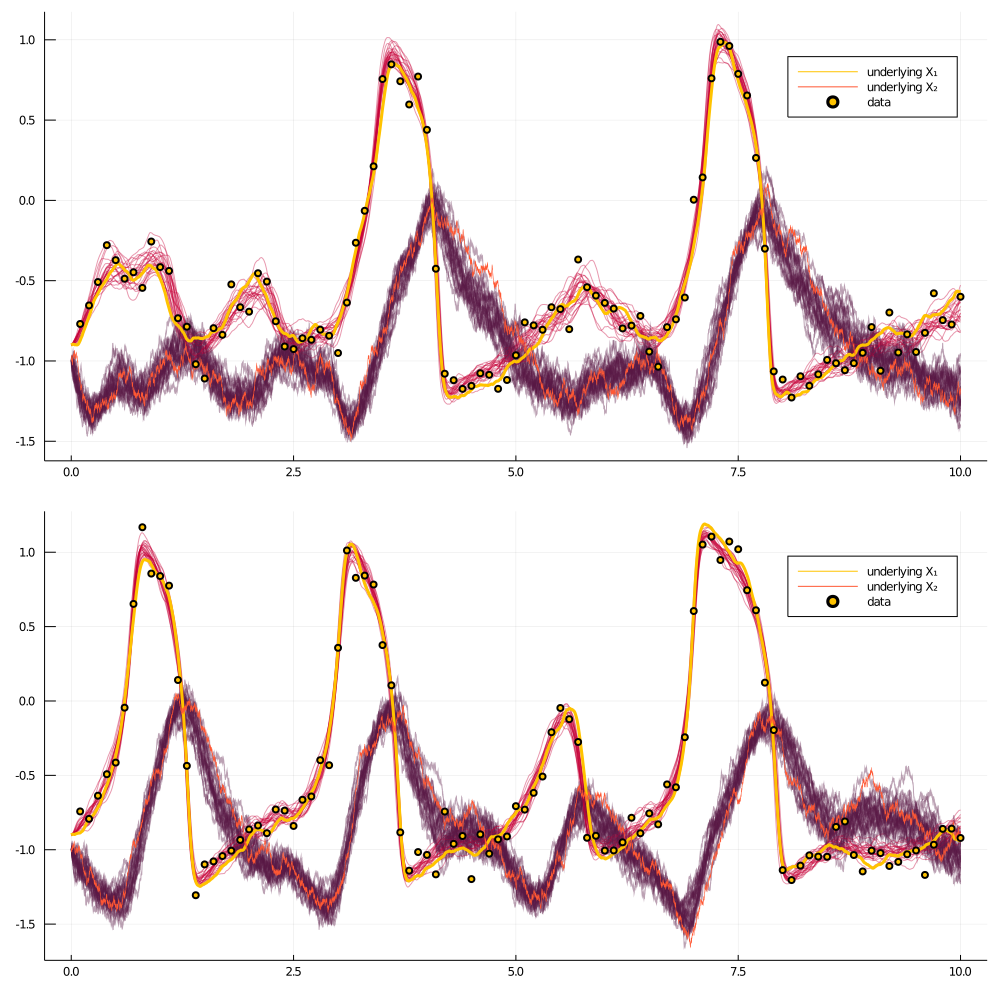

# BlockEnsemble
***
```@docs
DiffusionMCMCTools.BlockEnsemble
```


# Example

## Set up

```julia
using GuidedProposals, DiffusionDefinition, ObservationSchemes, DiffusionMCMCTools
const GP = GuidedProposals
const DD = DiffusionDefinition
const OBS = ObservationSchemes
const dMCMCt = DiffusionMCMCTools

using StaticArrays, Random, Plots, Distributions

# seed used for this tutorial
Random.seed!(100)

@load_diffusion FitzHughNagumo
θ = [0.1, -0.8, 1.5, 0.0, 0.3]
P = FitzHughNagumo(θ...)
tt, y1 = 0.0:0.0001:10.0, @SVector [-0.9, -1.0]
num_recs = 2
Xs = [rand(P, tt, y1) for i in 1:num_recs]
obs_scheme = ObsScheme(
    LinearGsnObs(
        0.0, (@SVector [0.0]);
        L=(@SMatrix [1.0 0.0]),
        Σ=(@SMatrix [0.01])
    )
)
data = [collect(obs_scheme, Xs[i], 1000) for i in 1:num_recs]

all_obs = AllObservations()
add_recordings!(
    all_obs,
    [build_recording(P, data[i], 0.0, KnownStartingPt(y1)) for i in 1:num_recs]
)
add_dependency!(
    all_obs,
    Dict(
        :γ_shared => [(1, :γ), (2, :γ)],
    )
)
DD.var_parameter_names(::FitzHughNagumo) = (:γ,)
all_obs, _ = initialize(all_obs)


ps = [plot(Xs[i], Val(:vs_time)) for i in 1:num_recs]
[scatter!(ps[i], map(x->x.t, data[i]), map(x->x.obs[1], data[i]), label="data") for i in 1:num_recs]
plot(ps..., layout=(num_recs,1), size=(800, 300*num_recs))
```


## The algorithm

```julia
customkernel(θ, scale=0.1) = θ .+ 2.0*scale*(rand()-0.5)

function accept_reject_proposal_param!(bc, mcmciter, θ, θ°)
    accepted = rand(Exponential(1.0)) > -(fetch_ll°(bc)-fetch_ll(bc))
    accepted && swap_XX!(bc)
    accepted && swap_PP!(bc)
    save_ll!(bc, mcmciter)
    accepted && swap_ll!(bc)
    accepted, copy(accepted ? θ° : θ)
end

function simple_inference(AuxLaw, all_obs, dt, _θ; ϵ=0.3, ρ=0.5, num_steps=10^4)
    # making sure that things are in order...
    _pname = collect(keys(_θ))
    # for simplicity restrict to inference for a single param
    @assert length(_pname) == 1
    pname = first(_pname)
    θ = collect(values(_θ))

    # setting the initial guess θ inside the recording
    OBS.set_parameters!(all_obs, _θ)

    # setting up containers
    tts = OBS.setup_time_grids(all_obs, dt, standard_guid_prop_time_transf)
    se = SamplingEnsemble(AuxLaw, all_obs.recordings, tts)
    be = BlockEnsemble(
        se,
        collect([[1:length(rec.obs)] for rec in all_obs.recordings]),
        ρ,
        num_steps
    )
    name_struct = ParamNamesAllObs(be, _pname, all_obs)

    loglikhd!(be)
    paths = []

    θθ = [θ]
    a_h = Bool[]
    crit_change = collect([[true] for rec in se.recordings])

    for i in 1:num_steps
        draw_proposal_path!(be)
        accept_reject_proposal_path!(be, i)

        θ° = customkernel(θ, ϵ)
        set_proposal_law!(be, θ°, name_struct, crit_change)

        accpt, θ = accept_reject_proposal_param!(be, i, θ, θ°)
        push!(θθ, θ)
        push!(a_h, accpt)

        # progress message
        if i % 100 == 0
            println(
                "$i. ll=$(ll_of_accepted(be, i)), ",
                "imp a-r: ",
                " $(accpt_rate(be, (i-99):i)), ",
                "updt a-r: ",
                "$(sum(a_h[(i-99):i])/100)."
            )
        end

        # save intermediate path for plotting
        i % 400 == 0 && append!(
            paths,
            [[deepcopy(rec.u.XX) for rec in se.recordings]]
        )
    end
    paths, θθ
end
```
## Results

```julia
using OrderedCollections

θ = OrderedDict(:γ_shared=>1.5)
@load_diffusion FitzHughNagumoAux
DD.var_parameter_names(::FitzHughNagumo) = (:γ,)
DD.var_parameter_names(::FitzHughNagumoAux) = (:γ,)
paths, θθ = simple_inference(
    FitzHughNagumoAux, all_obs, 0.001, θ; ϵ=0.3, ρ=0.96, num_steps=10^4
)

plot(getindex.(θθ, 1))
```


```julia
function glue_paths(XX)
    XX_glued = trajectory(
        glue_containers( map(x->x.t, XX) ),
        glue_containers( map(x->x.x, XX) ),
    )
end

function glue_containers(xs)
    glued_xs = collect(Iterators.flatten(map(x->x[1:end-1], xs)))
    append!(glued_xs, [xs[end][end]])
    glued_xs
end

convenient_paths = [glue_paths.(getindex.(paths, i)) for i in 1:num_recs]

col = ["#581845", "#900C3F", "#C70039", "#FF5733", "#FFC300"]

p = collect([plot() for i in 1:num_recs])
for i in 1:num_recs
    for path in convenient_paths[i]
    	plot!(p[i], path, Val(:vs_time), alpha=0.4, label="", color=[col[3] col[1]])
    end
    plot!(p[i], Xs[i], Val(:vs_time), color=[col[5] col[4]], linewidth=[3 0.5], label=["underlying X₁" "underlying X₂"])
    scatter!(p[i], map(x->x.t, data[i]), map(x->x.obs[1], data[i]), label="data", markercolor=col[5])
end
plot(p..., layout=(num_recs, 1), size=(1000, 500*num_recs))
```

