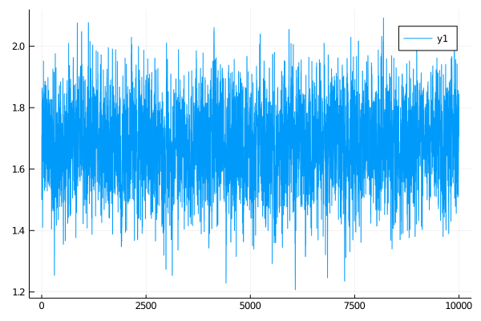

# Inference with `BiBlock`s
*****
```julia
customkernel(θ, scale=0.1) = θ .+ 2.0*scale*(rand()-0.5)

#=
    NOTE: this will appear to be completely unnecessary and coming out of the
    blue if you are not considering more complicated settings of mixed effect
    models. Looking up ahead into the definition of ... should be helpful if
    you want to understand what the function below is aiming to do.

    In here, we are just creating the most basic struture that is needed for
    setting parameters. It can be much more complex if blocking, multiple
    updates and/or mixed effect models were used.
=#
#↓ ↓ ↓ ↓ ↓ ↓ ↓ ↓ ↓ ↓ ↓ ↓ ↓ ↓ ↓ ↓ ↓ ↓ ↓ ↓ ↓ ↓ ↓ ↓ ↓ ↓ ↓ ↓ ↓ ↓ ↓ ↓ ↓ ↓ ↓ ↓ ↓ ↓ ↓ ↓
_build_struct(N, args...) = (
    var = tuple(),
    var_aux = fill(tuple(), N),
    updt = tuple(args...),
    updt_aux = fill(tuple(args...), N),
    updt_obs = fill(tuple(), N),
)

function simple_name_structure(pname::Symbol, num_obs)
    pnames = (
        PP = _build_struct(num_obs, (1=>pname)),
        P_last = _build_struct(0), # was num_obs
        P_excl = _build_struct(0),
        Pb_excl = _build_struct(num_obs, (1=>pname)),
    )
end
#↑ ↑ ↑ ↑ ↑ ↑ ↑ ↑ ↑ ↑ ↑ ↑ ↑ ↑ ↑ ↑ ↑ ↑ ↑ ↑ ↑ ↑ ↑ ↑ ↑ ↑ ↑ ↑ ↑ ↑ ↑ ↑ ↑ ↑ ↑ ↑ ↑ ↑ ↑ ↑

function accept_reject_proposal_param!(bb, mcmciter, θ, θ°)
    accepted = rand(Exponential(1.0)) > -(bb.b°.ll - bb.b.ll)
    accepted && swap_XX!(bb)
    accepted && swap_PP!(bb)
    save_ll!(bb, mcmciter)
    accepted && swap_ll!(bb)
    accepted, copy(accepted ? θ° : θ)
end

function simple_inference(AuxLaw, recording, dt, _θ; ϵ=0.3, ρ=0.5, num_steps=10^4)
    # making sure that things are in order...
    _pname = collect(keys(_θ))
    # for simplicity restrict to inference for a single param
    @assert length(_pname) == 1
    pname = first(_pname)
    θ = collect(values(_θ))

    # setting the initial guess θ inside the recording
    OBS.set_parameters!(recording, _θ)

    # setting up containers
    num_obs = length(recording.obs)
    tts = OBS.setup_time_grids(recording, dt, standard_guid_prop_time_transf)
    sp = SamplingPair(AuxLaw, recording, tts)
    bb = BiBlock(sp, 1:num_obs, ρ, true, num_steps)
    name_struct = simple_name_structure(pname, num_obs)

    loglikhd!(bb)
    paths = []

    θθ = [θ]
    a_h = Bool[]

    for i in 1:num_steps
        draw_proposal_path!(bb)
        accept_reject_proposal_path!(bb, i)

        θ° = customkernel(θ, ϵ)
        set_proposal_law!(bb, θ°, name_struct, true)

        accpt, θ = accept_reject_proposal_param!(bb, i, θ, θ°)
        push!(θθ, θ)
        push!(a_h, accpt)

        # progress message
        if i % 100 == 0
            println(
                "$i. ll=$(ll_of_accepted(bb, i)), ",
                "imp a-r: ",
                " $(accpt_rate(bb, (i-99):i)), ",
                "updt a-r: ",
                "$(sum(a_h[(i-99):i])/100)."
            )
        end

        # save intermediate path for plotting
        i % 400 == 0 && append!(paths, [deepcopy(sp.u.XX)])
    end
    paths, θθ
end
```

```julia
plot(getindex.(θθ, 1))
```

