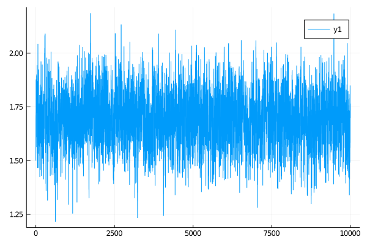

# Inference with blocking with `BiBlock`s
****
```julia
#↓ ↓ ↓ ↓ ↓ ↓ ↓ ↓ ↓ ↓ ↓ ↓ ↓ ↓ ↓ ↓ ↓ ↓ ↓ ↓ ↓ ↓ ↓ ↓ ↓ ↓ ↓ ↓ ↓ ↓ ↓ ↓ ↓ ↓ ↓ ↓ ↓ ↓ ↓ ↓
function simple_name_structure_not_last(pname::Symbol, num_obs)
    pnames = (
        PP = _build_struct(num_obs-1, (1=>pname)),
        P_last = _build_struct(1, (1=>pname)),
        P_excl = _build_struct(1, (1=>pname)),
        Pb_excl = _build_struct(num_obs-1, (1=>pname)),
    )
end

function simple_name_structure_blocking(pname::Symbol, block_layout)
    map(block_layout) do block_set
        map(enumerate(block_set)) do (i, block)
            (
                i == length(block_set) ?
                simple_name_structure(pname, length(block)) :
                simple_name_structure_not_last(pname, length(block))
            )
        end
    end
end
#↑ ↑ ↑ ↑ ↑ ↑ ↑ ↑ ↑ ↑ ↑ ↑ ↑ ↑ ↑ ↑ ↑ ↑ ↑ ↑ ↑ ↑ ↑ ↑ ↑ ↑ ↑ ↑ ↑ ↑ ↑ ↑ ↑ ↑ ↑ ↑ ↑ ↑ ↑ ↑

function accept_reject_proposal_param!(B::AbstractArray{<:BiBlock}, mcmciter, θ, θ°)
    accepted = rand(Exponential(1.0)) > mapreduce(bb->-(bb.b°.ll - bb.b.ll),+,B)
    accepted && swap_XX!.(B)
    accepted && swap_PP!.(B)
    (bb->save_ll!(bb.b, mcmciter)).(B)
    (bb->save_ll!(bb.b°, mcmciter)).(B)
    accepted && swap_ll!.(B)
    accepted, copy(accepted ? θ° : θ)
end


function simple_inference_with_blocking(
        AuxLaw, recording, dt, AuxLawBlocking, block_layout, _θ;
        ϵ=0.3, ρ=0.5, num_steps=10^4
    )
    # making sure that things are in order...
    _pname = collect(keys(_θ))
    # for simplicity restrict to inference for a single param
    @assert length(_pname) == 1
    pname = first(_pname)
    θ = collect(values(_θ))

    # setting the initial guess θ inside the recording
    OBS.set_parameters!(recording, _θ)

    # setting up containers
    tts = OBS.setup_time_grids(recording, dt, standard_guid_prop_time_transf)
    sp = SamplingPair(AuxLaw, recording, tts)
    blocks = [
        [
            BiBlock(sp, br, ρ, i==length(block_ranges), num_steps)
            for (i,br) in enumerate(block_ranges)
        ] for block_ranges in block_layout
    ]
    name_struct = simple_name_structure_blocking(pname, block_layout)

    paths = []

    θθ = [θ]
    a_h = Bool[]

    # MCMC
    for i in 1:num_steps
        for B in blocks
            GP.set_obs!.(B)
            (bb->recompute_guiding_term!(bb.b)).(B)
            find_W_for_X!.(B)
            loglikhd!.(B)
            draw_proposal_path!.(B)
            accept_reject_proposal_path!.(B, i)

            # progress message
            if i % 100 == 0
                println(
                    "$i. ll=$(ll_of_accepted.(B, i)), acceptance rate: ",
                    "$( map(bb->accpt_rate(bb, (i-99):i), B) )"
                )
            end
        end

        θ° = customkernel(θ, ϵ)

        B = blocks[end]
        for (idx, bb) in enumerate(B)
            set_proposal_law!(bb, θ°, name_struct[end][idx], true)
        end
        (bb->recompute_guiding_term!(bb.b°)).(B)

        accpt, θ = accept_reject_proposal_param!(B, i, θ, θ°)
        push!(θθ, θ)
        push!(a_h, accpt)

        if i % 100 == 0
            println(
                "$i. updt a-r: ",
                "$(sum(a_h[(i-99):i])/100)."
            )
        end

        # save intermediate path for plotting
        i % 400 == 0 && append!(paths, [deepcopy(sp.u.XX)])
    end
    paths, θθ
end
```


```julia
using OrderedCollections

θ = OrderedDict(:γ=>1.5)

DD.var_parameter_names(::FitzHughNagumo) = (:γ,)
DD.var_parameter_names(::FitzHughNagumoAux) = (:γ,)

@load_diffusion FitzHughNagumoAux
paths, θθ = simple_inference_with_blocking(
    FitzHughNagumoAux, recording, 0.001, FitzHughNagumoAux,
    [[1:25,26:75,76:100],[1:50, 51:100]], θ; ϵ=0.3, ρ=0.96, num_steps=10^4
)

plot(getindex.(θθ, 1))
```

