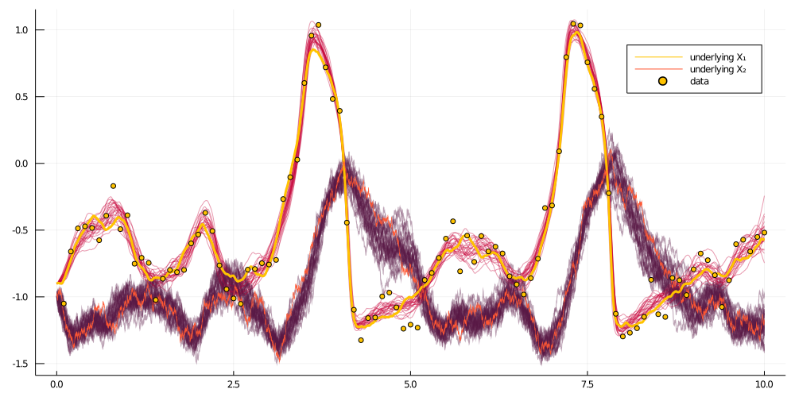

# Smoothing with `BiBlock`s
****
```julia
function simple_smoothing(AuxLaw, recording, dt; ρ=0.5, num_steps=10^4)
    tts = OBS.setup_time_grids(recording, dt, standard_guid_prop_time_transf)
    # this object contains containers
    sp = SamplingPair(AuxLaw, recording, tts)
    # and this has pointers to containers and facilitates actual sampling
    bb = BiBlock(sp, 1:length(recording.obs), ρ, true, num_steps)
    loglikhd!(bb)
    paths = []

    # MCMC
    for i in 1:num_steps
        # impute a path
        draw_proposal_path!(bb)
        # Metropolis–Hastings accept/reject step
        accept_reject_proposal_path!(bb, i)

        # progress message
        if i % 100 == 0
            println(
                "$i. ll=$(ll_of_accepted(bb, i)), acceptance rate: ",
                "$(sum(bb.accpt_history[(i-99):i])/100)"
            )
        end

        # save intermediate path for plotting
        i % 400 == 0 && append!(paths, [deepcopy(bb.b.XX)])
    end
    paths
end

paths = simple_smoothing(
    FitzHughNagumoAux, recording, 0.001; ρ=0.96, num_steps=10^4
)
```


```julia
plot_imputed_trajectories(paths)
```

